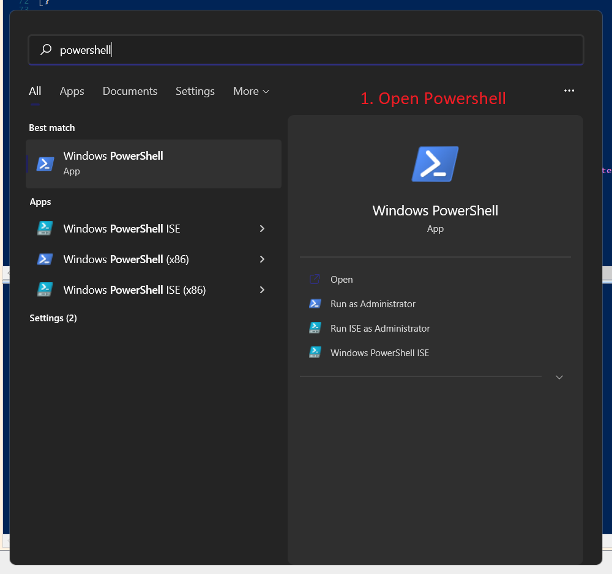
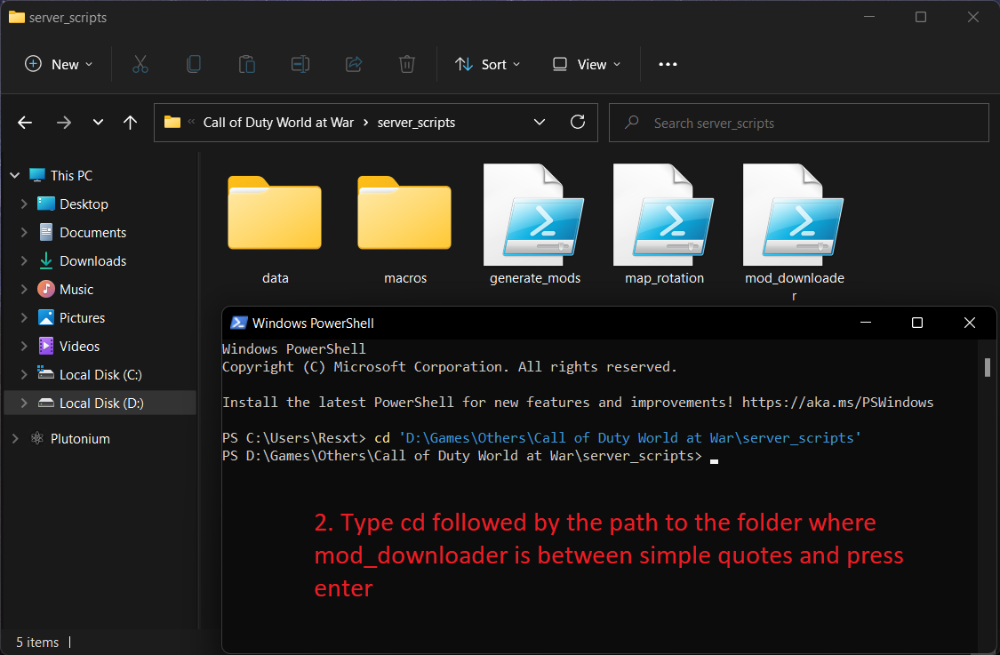
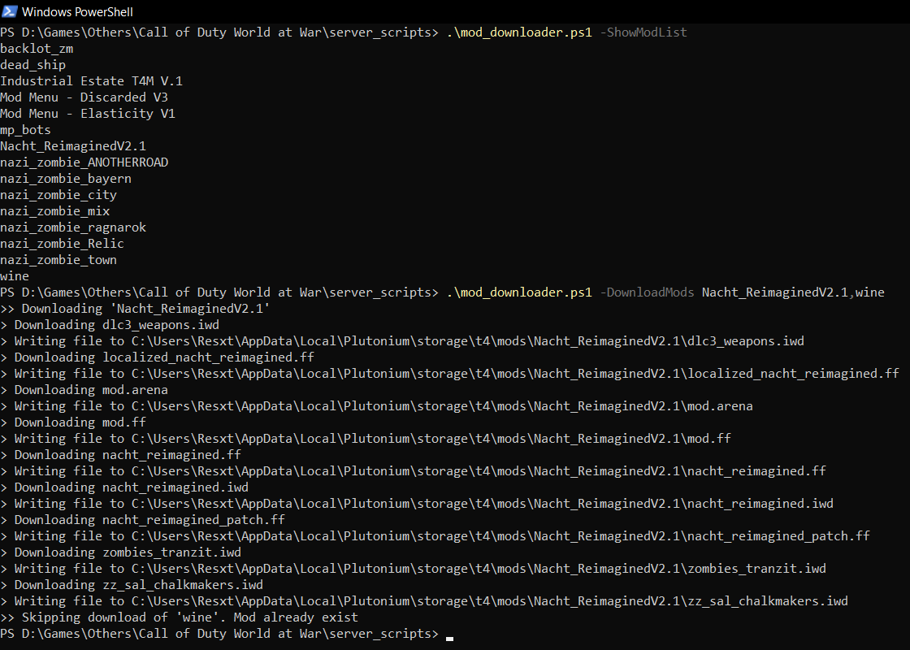
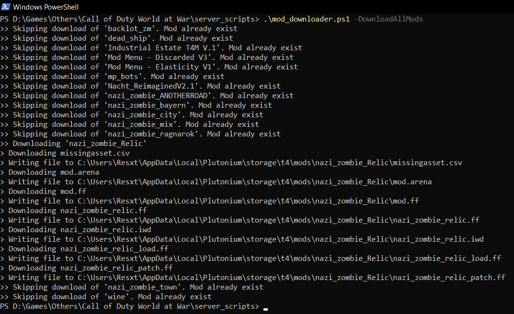
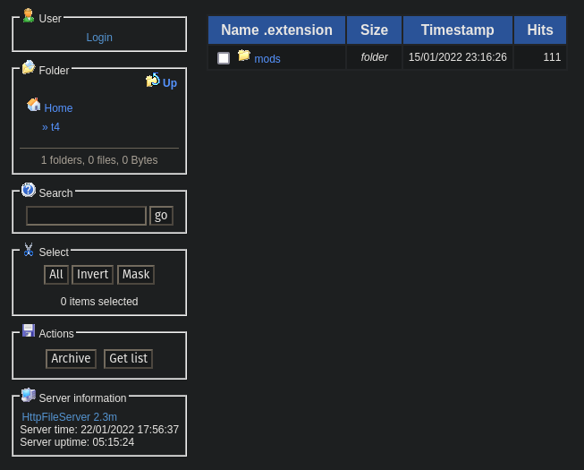

# Plutonium T4 Mod Downloader  

## Description

### What is this?

This is a PowerShell script that allows players to list all the mods available on a web server (usually used for FastDL) and download one/multiple/all mod(s) directly from that server.

The idea behind it is to allow players to download and install maps while they're not playing so that they don't have to wait for the download when joining a server. The script skips mods already installed on the players PC.

### Issues/future updates
For now this script only works with mods that only contain files.\
If there are folders in one of your mod only the files will be downloaded on the players PC.\
This will be fixed in a future update.

Having certain characters like `[` in a mod name seems to make the URL invalid for the script.

For now server owners must add exclusions manually to make sure the script doesn't list page elements as mods and or mod files.\
In the future the goal would be to provide pre-made exclusions for popular web servers.\
Don't hesitate to share your exclusions by contributing to the code or contacting me on Discord: `Resxt#5079`

## How to use - Players

### Setup

If you got redirected here for the download you can download the script [here](https://raw.githubusercontent.com/Resxt/T4-Server-Scripts/main/mod_downloader/mod_downloader.ps1) by right-clicking anywhere and clicking on `Save page as`.\
Make sure to put `.ps1` at the end of the file name and to choose `all or all files` in `Save as/save as type.p`
Then once you run the script you will have to put the web server/Fast DL URL like prompted. You can get this by reading the instructions on the server you're coming from or asking there.

If you already downloaded the script from somewhere else it probably comes with a `data` folder which has a configuration file that holds the IP, so you can just run the script.

It's recommended to put the script in a folder to keep things organized. For example in a folder called `server_scripts` in your World at War folder.

### Using the script

Once you're here you run the script by typing `.\mod_downloader.ps1`\
The script works with options so running the script without any option will just create your configuration and exit.\
The available options can be cycled through by putting a space and a `-` after `.\mod_downloader.ps1` and pressing tab. You can only run one option at a time.

* `-ShowModList` will give you the names of the mods available on the server
* `-DownloadMods` allow you to download and install one or multiple mod(s) by giving mod name(s) obtained with `-ShowModList` separated by a comma without any space between each mod name. You can copy a mod name by highlighting it and pressing `CTRL+C` (be careful pressing `CTRL+C` twice will stop the script). You can paste it by right-clicking in the command prompt.
* `-DownloadAllMods` downloads and installs all the mods available on the server. This will skip downloading the maps you already have installed.
* `-EditConfig` deletes the current config file and lets you create your configuration again

## How to use - Server owners

This script was made to work with [HFS](https://www.rejetto.com/hfs/?f=dl) but can easily be adapted for other web servers as well.\
To my knowledge there are web servers that don't even need any exclusion like Windows IIS.\
If you're using HFS you can skip to [share the script to my players](#share-the-script-to-my-players) since the script already has the required exclusions.

### Adding exclusions for my web server

The script is getting most of the elements on the web server page, so it will try to download mods with invalid options.\
To prevent that there is an `excluded` array you can modify to exclude invalid options when the script goes on your `mods` page and also when it gets all the files from a mod.

For example with HFS the `excluded` array contains everything you see on the left.\
Otherwise, it would try to download `your_webserver_ip/mods/Login`, `your_webserver_ip/mods/Up` etc.

To set up the exclusions first remove everything in the `excluded` array at the top of the script.

**(Mandatory) Add exclusions for the `mods` page (the page that lists all your mods)**\
Run the script with `-ShowModList`, copy everything that shouldn't be here and add them to the excluded array respecting the format.\
This will exclude static elements but if there are dynamic elements like the current date you'll have to add some code in the script or switch to HFS (or a web server that doesn't display a lot of content)

**(Optional) Add exclusions for the mod page (the page that lists the files of a single mod)**\
This is not mandatory because the script will just skip the resource if the resource is not found on the server, but it's still recommended to avoid printing errors in the user console.\
Run the script with `-DownloadMaps one_of_your_maps` for example `-DownloadMaps nazi_zombie_town` and see what the error says.\
You can then set up your own static and/or dynamic exclusions in the `DownloadMod` function in the source code.\
For example HFS has one more element to exclude when going on a mod page `» nazi_zombie_town` which is excluded dynamically with the `$ModName` variable in the `DownloadMod` function with `if ($_ -ne "» $ModName")`where `$_` is the element on the page currently being checked.

### Share the script to my players

You can run the script with the `-EditConfig` option to generate a config to make the script ready to use without any configuration for the players.\
Then you can share the `data` folder and the `mod_downloader.ps1` file and link the tutorial [How to use - Players](#how-to-use---players)
